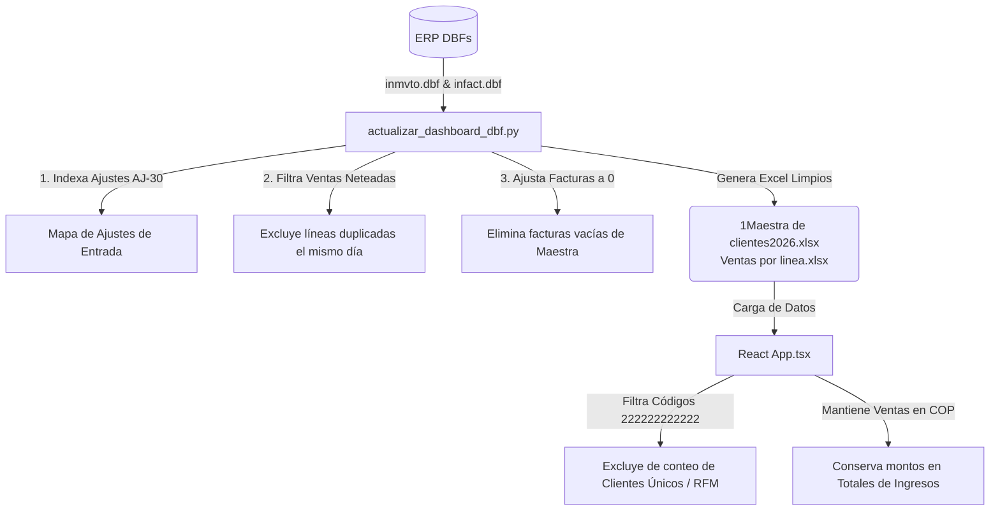

# Documentación Técnica: Filtro de Exclusión de Consumidor Final

Este documento detalla la problemática del cliente genérico **CONSUMIDOR FINAL** en el ERP de Distribuidora JR, las distorsiones que generaba en el Dashboard de ventas, y la solución implementada a nivel de base de datos (backend) y visualización (frontend).

---

## 1. El Problema (El "¿Por qué?")

En el ERP SIESA de la distribuidora, las ventas de mostrador o de caja rápida que no se asocian a un cliente específico se registran bajo el código genérico de **CONSUMIDOR FINAL** (identificado con los códigos `222222222222` y/o `222222`). 

Esto provocaba dos tipos de distorsiones graves en el análisis comercial:

### A. Distorsión de Métricas Basadas en Clientes
Dado que miles de transacciones de caja de diferentes personas reales se agrupaban bajo una única cuenta de "Consumidor Final":
- **Ticket Promedio Sesgado**: Al calcular `Ventas Totales / Clientes Únicos`, la presencia de Consumidor Final como un solo cliente con facturaciones de miles de millones inflaba desmesuradamente el promedio general.
- **Análisis de Inactividad (RFM) Inútil**: Consumidor Final registraba compras casi a diario, por lo que el algoritmo lo clasificaba siempre como "Saludable" con 0 días de inactividad, ocultando las alarmas de inactividad de los clientes reales.
- **Cobertura de Asesores Inflada**: Los asesores parecían tener una cobertura ideal por registrar al cliente más activo, cuando en realidad eran ventas genéricas de mostrador.

### B. Transacciones de Compensación Ficticias (Same-Day Netted Sales)
El ERP registra facturas de venta (`FE` o `CT`) asociadas a Consumidor Final y, en el mismo día, genera un **Ajuste de Entrada** (Documento `AJ` con Concepto `30`) para el mismo producto y con la misma cantidad exacta. 
- Estas transacciones se realizan por razones administrativas y de cuadre de caja/inventario en el ERP.
- No representan demanda real de mercado y distorsionan por completo las cantidades vendidas (`cant`), afectando las proyecciones de reabastecimiento y los análisis de rotación de inventario en el Dashboard.

---

## 2. La Solución Técnica (El "¿Qué se hace?")

Para limpiar los indicadores sin perder la recaudación real de dinero, se implementó una estrategia dividida en dos capas:

### Capa 1: Backend y Limpieza de Datos (`actualizar_dashboard_dbf.py`)
Durante la conversión de las bases de datos DBF de FoxPro a archivos de Excel para el Dashboard, el script de Python realiza lo siguiente:

1. **Pre-escaneo de Ajustes**: Recorre `inmvto.dbf` buscando movimientos donde `MOV_DOC == 'AJ'` y `MOV_CPTO == '30'`. Indexa estos registros en un diccionario con la clave `(fecha, codigo_articulo, cantidad_ajustada)`.
2. **Exclusión de Líneas de Venta Neteadas**: Al recorrer los movimientos de ventas (`FE`/`CT`), si el código de cliente es `222222222222` y existe una coincidencia de ajuste de entrada el mismo día por el mismo artículo y cantidad:
   - Se consume el ajuste (`count - 1`).
   - Se **descarta la línea de venta** para que no se escriba en `Ventas por linea.xlsx`.
   - Se acumula el total en pesos de esta línea descartada para esa factura en particular.
3. **Ajuste de Cabeceras**: Al finalizar el bucle de movimientos, el script recorre las facturas cargadas de la cabecera (`clientes_maestra`). Resta la suma acumulada de las líneas excluidas del total de la factura. Si el total de una factura se reduce a 0 o menor, se **elimina por completo** del archivo `1Maestra de clientes2026.xlsx`.

### Capa 2: Frontend y Segmentación de Métricas (`src/App.tsx`)
Dado que las transacciones reales de mostrador a Consumidor Final que no tienen ajuste compensatorio se mantienen en el Excel para no perder la facturación en pesos, el frontend de React aplica filtros lógicos para segmentar su impacto:

1. **Carga Inicial (`fetchAndParseExcel`)**:
   - Evita agregar los códigos de cliente `222222222222` y `222222` a los conjuntos de cobertura mensuales y anuales de los asesores (`clients2026` y `clientsGeneral`).
2. **Ingresos vs Clientes (`salesData`)**:
   - Conserva la suma de los valores en pesos de las ventas (`salesMap[name].sales += val` y `grandTotal += val`).
   - Evita registrar el código del cliente en los Sets de clientes únicos (`salesMap[name].clientCodes` y `globalUniqueClientsSet`).
   - Esto permite que el cálculo de ticket promedio general y por asesor (`ventas_totales / clientes_activos`) sea representativo de los clientes reales.
3. **Frecuencia de Compra (`frequencyData`)**:
   - Omite las facturas de estos códigos genéricos de la suma de facturas del asesor para no inflar su índice de recompra de clientes.
4. **RFM y Recencia (`clientRecencyData`)**:
   - Descarta el registro de Consumidor Final antes de procesar la fecha de última compra. De este modo, no figura en la tabla de clientes en riesgo de inactividad, lo que evita alertas falsas.
5. **Tendencias y KPIs Globales (`monthlyTrends`, `kpis`)**:
   - Omite las entradas genéricas al calcular los clientes activos por mes y el total de clientes únicos del negocio.

---

## 3. Guía para Futuras Modificaciones y Mantenimiento

Si otro agente o desarrollador necesita modificar la base de datos o agregar nuevas vistas comerciales, debe tener en cuenta las siguientes reglas de oro:

> [!IMPORTANT]
> **Preservación del dinero en los reportes**  
> Nunca debe filtrarse el cliente `222222222222` directamente desde la cabecera en el backend si esto reduce los ingresos financieros reales. El total de ventas reportado en el dashboard debe cuadrar exactamente con los estados contables del ERP.

> [!TIP]
> **Campos de Validación en el ERP**  
> Si la estructura de los movimientos del ERP cambia, valide que el campo de concepto de inventario (`MOV_CPTO`) en `inmvto.dbf` siga siendo el encargado de identificar los ajustes de entrada (código `30`).

> [!WARNING]
> **Códigos alternativos de Consumidor Final**  
> Si en el futuro el ERP registra un nuevo código genérico para ventas al público (por ejemplo, `222222` de 6 dígitos), asegúrese de añadirlo a las constantes de exclusión en `src/App.tsx`.
